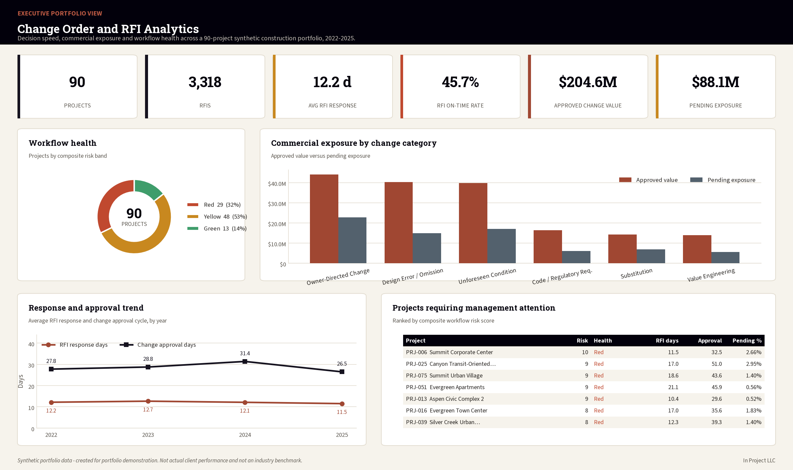
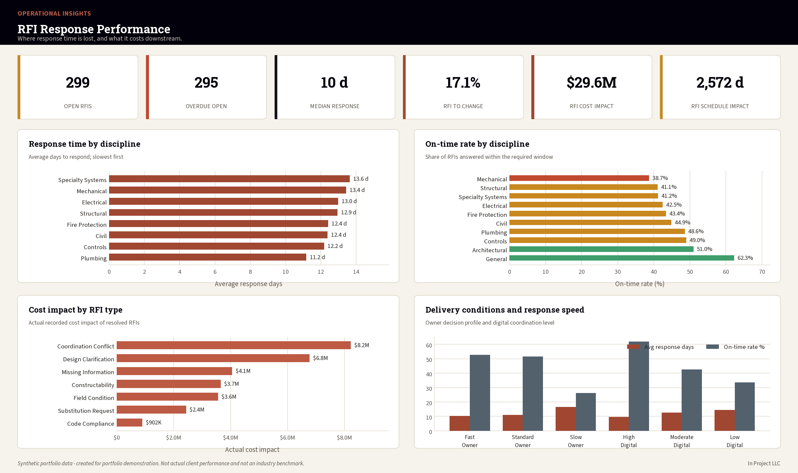
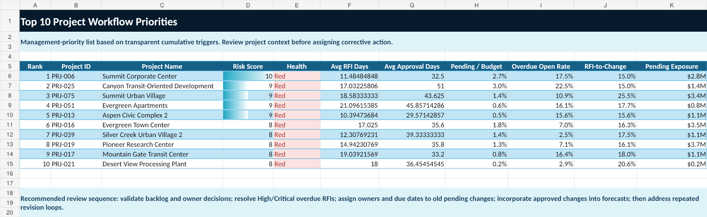
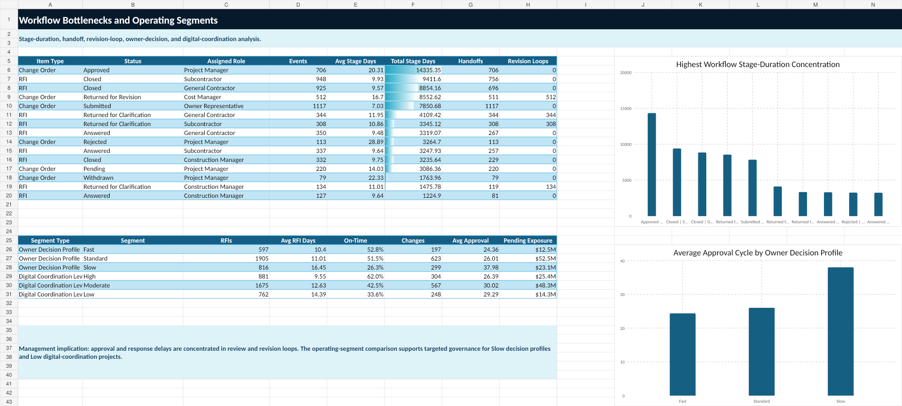

# Construction Change Order and RFI Analytics

**Root-Cause, Cycle-Time, and Impact Analysis for Construction Decision Workflows**

An end-to-end construction analytics portfolio case study examining RFI response performance, change-order approval cycles, workflow bottlenecks, commercial exposure, and project-level management priorities across 90 synthetic construction projects.

> **Synthetic-data disclosure:** All projects, organizations, people, budgets, schedules, RFIs, change orders, workflow events, and performance records in this repository are synthetic. The data is fictional and must not be represented as actual client, company, employee, project, or industry-benchmark information.

## Read the case study

**[Construction Change Order and RFI Analytics — Case Study (PDF, 13 pages)](reports/Construction_Change_Order_and_RFI_Analytics_Case_Study.pdf)**  ·  [DOCX version](reports/Construction_Change_Order_and_RFI_Analytics_Case_Study.docx)

The report is the fastest way to review this project end to end: business framing, data quality, analysis, dashboards, act plan and limitations, with a linked table of contents. Everything else in this repository is the supporting evidence.

| Deliverable | Location |
|---|---|
| Case-study report | [`reports/`](reports) |
| Dashboards | [Executive](assets/executive-dashboard.png) · [Operational](assets/operational-dashboard.png) · [Workflow](assets/workflow-analysis.png) · [Priority](assets/project-priority.png) |
| Analytical outputs | [`analysis/tables/`](analysis/tables) |
| SQL | [`sql/`](sql) |
| Documentation | [`documentation/`](documentation) |

## Portfolio highlights

- 90 synthetic construction projects
- 3,318 clean RFI records
- 1,119 clean change orders
- 11,286 clean workflow events
- 677 clean RFI-to-change relationship records
- 12.21-day average RFI response
- 45.68% RFI on-time rate
- $204.57M approved change value
- $88.10M pending change exposure
- 29 Red, 48 Yellow, and 13 Green project workflow-health statuses
- Pearson r = 0.817 between project-average RFI response time and project-average change approval cycle

The relationship above is an association in a synthetic dataset, not proof of causation.

## Dashboards









## Project files

| Asset | Path |
|---|---|
| Final PDF report | [`reports/Construction_Change_Order_and_RFI_Analytics_Case_Study.pdf`](reports/Construction_Change_Order_and_RFI_Analytics_Case_Study.pdf) |
| Final Word report | [`reports/Construction_Change_Order_and_RFI_Analytics_Case_Study.docx`](reports/Construction_Change_Order_and_RFI_Analytics_Case_Study.docx) |
| Share dashboard workbook | [`dashboards/construction_change_order_rfi_share_dashboard.xlsx`](dashboards/construction_change_order_rfi_share_dashboard.xlsx) |
| Act workbook | [`dashboards/construction_change_order_rfi_act_plan.xlsx`](dashboards/construction_change_order_rfi_act_plan.xlsx) |
| Analysis workbook | [`analysis/excel/construction_change_order_rfi_analysis.xlsx`](analysis/excel/construction_change_order_rfi_analysis.xlsx) |
| Analytical CSV outputs | [`analysis/tables/`](analysis/tables/) |
| SQL schema and analysis views | [`sql/`](sql/) |
| Automation package | [`automation/`](automation/) |
| Portfolio web pages | [`portfolio/`](portfolio/) |

## Analytical lifecycle

The project follows the Ask, Prepare, Process, Analyze, Share, and Act lifecycle, with terminology aligned to CRISP-DM, DMAIC, Microsoft's data-science lifecycle, and PMI project-governance process groups.

| Phase | Status |
|---|---|
| Ask | Complete |
| Prepare | Complete |
| Process | Complete |
| Analyze | Complete |
| Share | Complete |
| Act | Complete |

## Methods and tools

- Excel
- SQL and SQLite
- Python
- Power BI and Tableau dashboard specifications
- Workflow analytics
- RFI and change-order relationship modeling
- Statistical association testing
- Management-alert automation
- Responsible AI governance and human-review controls

## Key findings

### RFI performance

The synthetic portfolio contains 3,318 clean RFI records, with a 12.21-day average response time and 45.68% on-time rate. Open and overdue RFIs remain a management focus, especially where field work is affected or priority is High/Critical.

### Change-order exposure

The case study includes 1,119 clean change orders, including 706 approved changes and 221 pending changes. Approved change value totals $204.57M, and pending change exposure totals $88.10M.

### Workflow health

Project workflow health is classified as 29 Red, 48 Yellow, and 13 Green projects. The Red projects are used to prioritize management attention and recovery planning in the Act phase.

### Tested relationship

The strongest tested relationship is between project-average RFI response time and project-average change approval cycle, with Pearson r = 0.817 and R-squared = 0.668. This result is diagnostic and exploratory; it does not establish causation.

## Automation

The Act-phase automation creates management exception files from validated Project 2 data:

```powershell
powershell -ExecutionPolicy Bypass -File automation\run_act_pipeline.ps1
```

Outputs are written to:

- `automation/output/management_alerts.csv`
- `automation/output/management_alert_summary.json`

No live recurring schedule, notification workflow, or external distribution is created by this package.

## Repository structure

```text
construction-change-order-rfi-analytics/
├── analysis/
├── assets/
├── automation/
├── dashboards/
├── data/
├── documentation/
├── portfolio/
├── reports/
└── sql/
```

## Limitations

- All data is synthetic.
- Results are not construction-industry benchmarks.
- Statistical relationships are associations, not causal claims.
- Exploratory model outputs are not approved for production decision-making.
- AI-related governance content is presented as responsible decision-support guidance, not as a replacement for qualified professional judgment.

## License and citation

Code is released under the MIT License. Synthetic data and original written documentation are shared under CC BY 4.0. Citation metadata is provided in [`CITATION.cff`](CITATION.cff).
