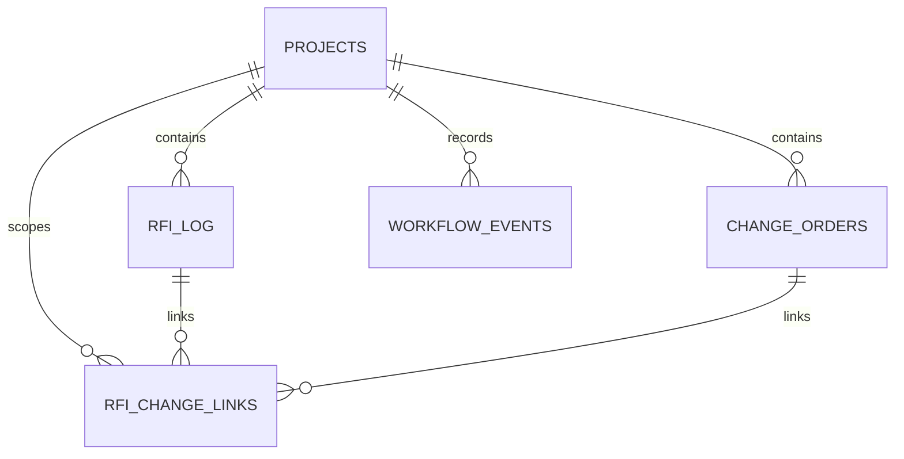

# Relational Data Model

## Entity relationship diagram



## Relationship details

| Parent | Child | Cardinality | Foreign key |
|---|---|---|---|
| Projects | RFI Log | One-to-many | RFI Log.Project_ID |
| Projects | Change Orders | One-to-many | Change Orders.Project_ID |
| Projects | Workflow Events | One-to-many | Workflow Events.Project_ID |
| Projects | RFI Change Links | One-to-many | RFI Change Links.Project_ID |
| RFI Log | RFI Change Links | One-to-many | RFI Change Links.RFI_ID |
| Change Orders | RFI Change Links | One-to-many | RFI Change Links.Change_Order_ID |

## Polymorphic workflow relationship

`Workflow_Events.Item_ID` references one of two parent entities:

- when `Item_Type = RFI`, Item_ID references `RFI_Log.RFI_ID`;
- when `Item_Type = Change Order`, Item_ID references `Change_Orders.Change_Order_ID`.

The Process phase will validate this logic explicitly because a standard single-column foreign key cannot enforce two parent tables directly.

## Analytical joins

### RFI response analysis

```text
Projects
  → RFI Log
  → Workflow Events filtered to Item_Type = RFI
```

### Change approval analysis

```text
Projects
  → Change Orders
  → Workflow Events filtered to Item_Type = Change Order
```

### Integrated RFI-to-change analysis

```text
Projects
  → RFI Log
  → RFI Change Links
  → Change Orders
```

## Grain preservation

Aggregations must respect table grain. Joining RFI and change tables directly without the link bridge may multiply records and overstate totals.
